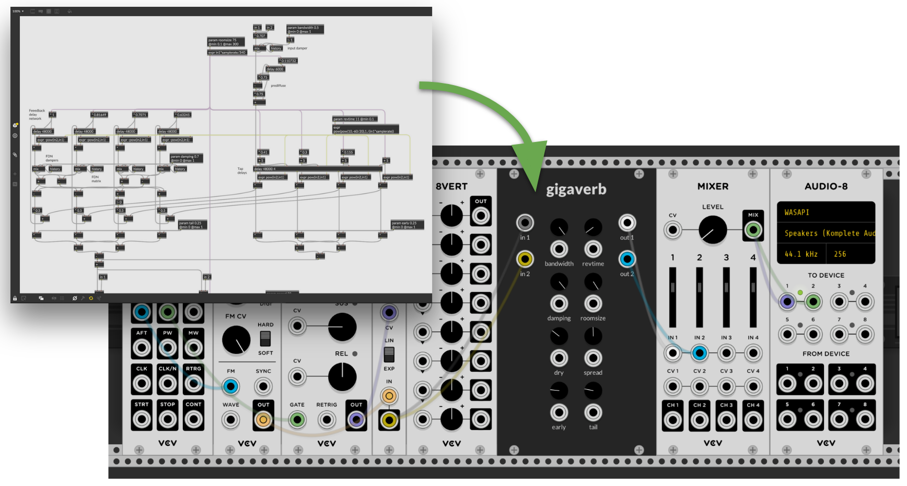

# gen-rack

Export gen~ patches to VCV Rack modules.

# How to use

First, you'll want to grab a copy of this repository (clone/download/etc). Then take a look at the [Getting Started](docs/getting-started.md) documentation for information on prerequisites and instructions on building your first gen-rack modules.

# License

gen-rack is licensed under the terms of GPL-3. All `gen~` code is licensed as following the header text in the generated source code.
