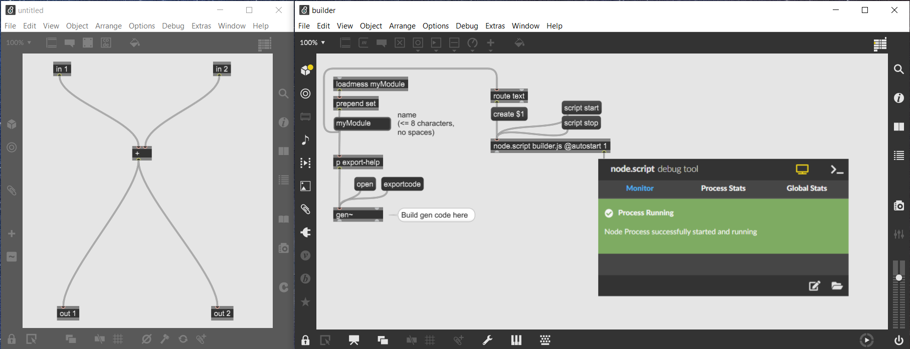
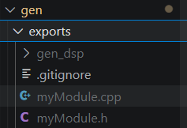
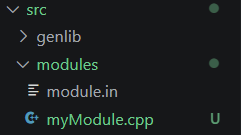
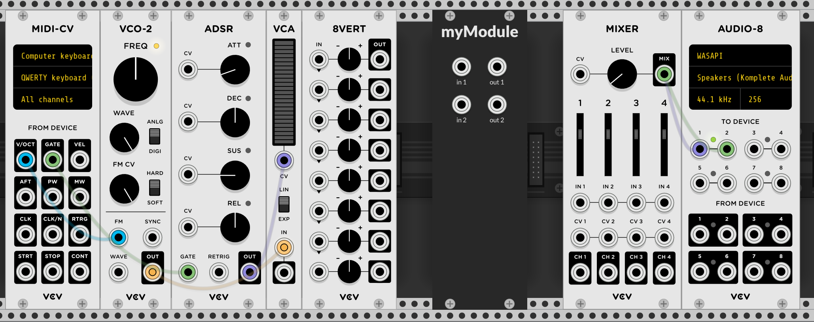

- [Overview](#overview)
- [0. Setting up your build environment](#0-setting-up-your-build-environment)
  - [Windows](#windows)
  - [Mac](#mac)
- [1. Creating a new project](#1-creating-a-new-project)
- [2. Editing your gen~ patch](#2-editing-your-gen-patch)
- [3. Exporting code from gen~](#3-exporting-code-from-gen)
- [4. Generate VCV Rack module code](#4-generate-vcv-rack-module-code)
  - [Optional - Adjust module GUI](#optional---adjust-module-gui)
- [5. Register your module](#5-register-your-module)
  - [`plugin.hpp`](#pluginhpp)
  - [`plugin.cpp`](#plugincpp)
  - [`plugin.json`](#pluginjson)
- [6. Building and installing the module](#6-building-and-installing-the-module)


# Overview

The workflow to generate a VCV Rack module will involve the following steps:

0. Set up a VCV Rack building environment.
1. Create a new project in the `/gen/projects/` directory which contains a template Max patch and some helper NodeJS scripts.
2. In that project, open the `builder.maxpat` and edit your `gen~` patch.
3. When you're ready, export the C++ code from `gen~`. It'll land in the `/gen/exports/` directory.
4. Still in the `builder.maxpat`, use the provided Node for Max script to generate the VCV Rack module code.
5. Make a few edits to `/src/plugin.cpp` and `plugin.json`.
6. Build and install your new VCV Rack module from the command line with `make install`.


Most of the heavy lifting is done by these scripts, so going from a `gen~` patch to a new VCV Rack module can be done in as little as a few minutes as opposed to hours.


# 0. Setting up your build environment

Requirements:
- Max 8 (Windows or Mac)
- VCV Development Environment
  - See the official [documentation](https://vcvrack.com/manual/Building) for how to set this up


# 1. Creating a new project

To create a new project, you can either copy and paste an existing project from the `/gen/projects/` directory or use the `/gen/projects/new-project.maxpat` which will do a copy for you.

# 2. Editing your gen~ patch



In your project folder, open the `builder.maxpat`. Edit the name of the project in the "name" textedit box. This will set the proper export folder for the `gen~` object.

Edit your `gen~` patch. Note that any inputs or outputs must be in the range -1 to 1. They will then be scaled to -5 to 5 volts in your VCV Rack module.

When to use inputs vs params:
- Inputs are processed at audio rate and have no knobs on the resulting VCV Rack interface.
- Params are processed at block rate and have both knobs and CV input on the VCV Rack interface.

# 3. Exporting code from gen~

Hit the `exportcode` message box! 

You can check everything was exported by looking in the `/gen/exports/` directory. There should be a `.cpp` and `.h` file with the name of your module. (If there isn't, check the inspector to make sure the `gen~` object's export folder is set to `/gen/exports/`.)



# 4. Generate VCV Rack module code

Hit the `create $1` message box. This runs the `builder.js` script which will create the boilerplate VCV Rack module code in `/src/modules/`.



Behind the scenes, it is using the `/src/modules/module.in` template and replacing some text to properly change the namespace, display name, and a few variables to match up with the name of your exported code.

## Optional - Adjust module GUI

If you're comfortable editing the look of your VCV Rack module, it is in this newly generated `.cpp` file where you can change the UI of your module. You'll want to take a look at the `struct` which inherits from `ModuleWidget` and make your changes there. 

# 5. Register your module

VCV Rack groups modules into groups called plugins. You've created a module, but you need to register it with your plugin.

## `plugin.hpp`
The builder script has already added a line to the end of `/src/plugin.hpp` that looks like this:

```
extern Model* modelMyModule;
```

This exposes the model for your module (which pairs the processing and interface parts of your module) so that the VCV Rack engine will know to register your plugin. Make sure this file looks okay. You can remove any duplicates if there are any.

## `plugin.cpp`

You'll also need to register the plugin in `/src/plugin.cpp`. For this `myModule` example, I'd edit `/src/plugin.cpp` to look like this:

```
void init(Plugin* p) {
    pluginInstance = p;

    // GENRACK: add modules here
    p->addModel(modelMyModule);
}
```

For any additional modules you create, you'll need to register them in the same way by adding in more lines in the designated area.

## `plugin.json`

This is the third and final place to register the module as part of your plugin.

The easiest way to see how to add modules to your plugin is to take a look at existing `plugin.json` files in the library. For example, see the `plugin.json` for the [Fundamental](https://github.com/VCVRack/Fundamental/blob/v2/plugin.json) modules.

For our example, I'll simply add `myModule` as the only module.

```
    "modules": [
        {
            "slug" : "myModule",
            "name" : "myModule",
            "description" : "My first gen-rack module",
            "tags" : [
                "effect"
            ]
        }
    ]
```


# 6. Building and installing the module

Now you should just need to open a terminal window, `cd` to the `gen-rack` directory, and run `make install`. (Do make sure you've exported the `RACK_DIR` environment variable as described in the [VCV Rack dev docs](https://manual.vcvrack.com/Building#setting-up-your-development-environment).)

(You may see some warnings about unused variables. This is okay.)

Open up VCV and check out your new module!


